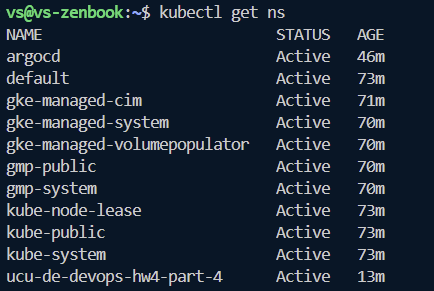
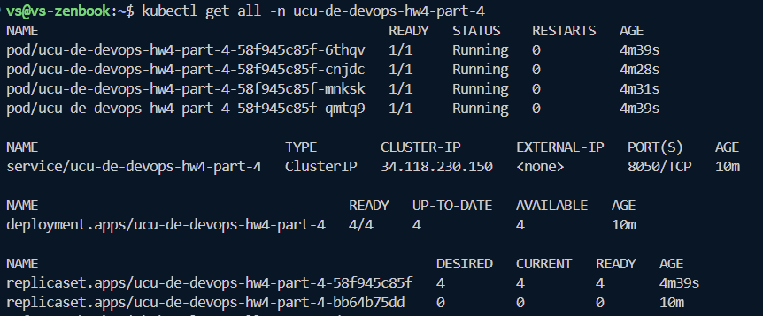
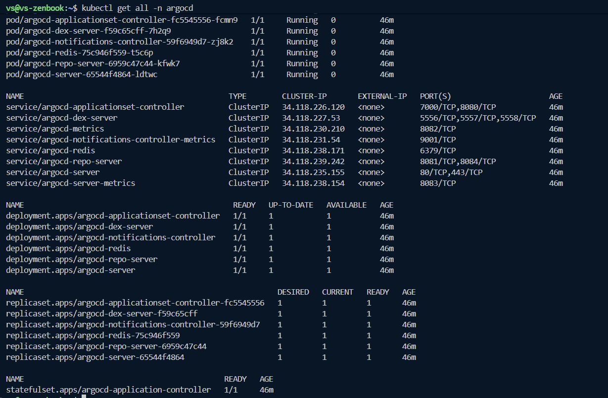
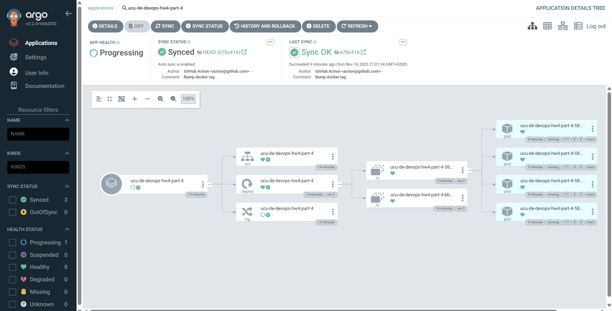

# DevOps HW4, task 4: Github actions + GKE + ArgoCD

Домашня робота виконана на основі https://github.com/elisska/github-actions-samples.

Кластер розгорнутий в Google Kubernetes Engine.

- Неймспейси

    

- Ресурси додатку

    

- Ресурси ArgoCD

    

- Дашборд додатку в ArgoCD

    